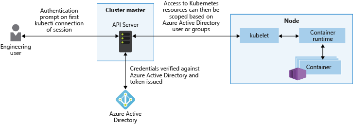

# Kubernetes (k8s)

## What is K8s

It is an `container orchestration engine`
It's an open source platform started `by google`. Borg it's is predecasor.

Kubernetes is a open source project that enables software teams of all sizes, from a small startup to a fortune 100 company, to automate deploying, scaling, and managing applications on a group of clusters of server machines

### Multi-Host container scheduling
1. By Kube-scheduler
2. Assigns pods to nodes at runtime
3. Checks resources, QoS policies, and user specification before scheduling

### Scalability & Availability
1. Master is deployed in a highly available configuration.
2. Multi region deployments
3. v1.8 scalability supports 5K node clusters and 150K total pods (horizontal scalability via api).

### Flexibility & Modulaziration
1. Plug and play architecture
2. Extend architecture when needed
3. Add-ons: network drivers, service discovery, container runtime, visualization and command

### Others
1. Seamless nodes **register** themselves with master
2. Automatic detection of services and endpoints via DNS or ENV variable
3. Pods can use persistent volumes to store data
4. Rolling upgrades and rollbacks (downgrades) are supported supported
5. Logging and monitoring are built in.
6. Secrets management: mounted as data volues or ENV variables
7. Governed by CNCF

## K8s Architecture

### Master Node
Responsible for the overall management of the Kubernetes Cluster.
Its got three components that take care of communication Scheduling, and controllers:-

#### API Server
allows you to interact with the Kubernetes API. It's the front end of the Kubernetes control plane.

#### Scheduler
watches created Pods, who do not have a Node design yet, and designs the Pod to run on a specific Node.

#### The Controller Manager
background threads that run tasks in a cluster. The controller actually has a bunch of different roles, but that's all compiled into a single binary.

The roles include,
* the Node Controller, who's responsible for the worker states,
* the Replication Controller, which is responsible for maintaining the correct number of Pods for the replicated controllers,
* the End-Point Controller, which joins services and Pods together.
* Service account and token controllers that handle access management.

#### etcd
A simple distributed key value stored. Used as database and stores all cluster data here.
E.g:-
* job scheduling info,
* Pod details,
* stage information,
* etc.

You interact with the Master Node using the Kubectl application, which is the command line interface for Kubernetes. It has a config file called a **Kubeconfig**. This file has server information, as well as authentication information to access the API Server.

**Worker Nodes**, Nodes where your applications operate. The Worker Nodes communicate back with the Master Node. Communication to a Worker Node is handled by the **Kubelet Process**.

#### Kubelet
Is an agent that communicates with the API Server to:-
* see if Pods have been designed to the Nodes.
* It executes Pod containers via the container engine.
* It mounts and runs Pod volume and secrets.
* Is aware of Pod of Node states and responds back to the Master.

This is where Docker comes in and works together with Kubelet to run containers on the Node.

#### Kube-proxy
Is the Network Proxy and load balancer for the service, on a single Worker Node.
It handles the network routing for TCP and UDP Packets, and performs connection forwarding.

Having the Docker Demon allows you to run containers. Containers of an application are tightly coupled together in a Pod.

#### Pod
the smallest unit that can be scheduled as a deployment in Kubernetes. This group of containers share storage, Linux name space, IP addresses, amongst other things.
They're also co-located and share resources that are always scheduled together. Once Pods have been deployed, and are running, the Kubelet process communicates with the Pods to check on state and health.
Kube-proxy routes any packets to the Pods from other resources that might be wanting to communicate with them.
Worker Nodes can be exposed to the internet via load balancer. And, traffic coming into the Nodes is also handled by the Kube-proxy,

which is how an End-user ends up talking to a Kubernetes application.

### Basic building blocks

### Node

It is a worker machine in K8s cluster. Can be a physical computer
or a VM.

Requirements:-
* A kubelet running
* Container tooling like docker
* Kube-proxy process running
* Supervisord

### Pod

Represents one running process on the cluster. Can create, deploy and delete pods.
It can be :-
* Docker app container
* storage resource
* unique network IP
* Options that govern how the container(s) should run.

Pod states: Pending, running, Succeeded, Failed & CrashLoopBackOff.

### Deployments, ReplicaSets & Services

Benefits of controllers
* App reliability
* Scaling
* Load balancing

#### Controller: ReplicaSet
Ensures that a specified number of replica for a pod running at all times

#### Controller: Deployment
Provides declarative updates for pods and ReplicaSets

Use Cases:-
* Pod Management, Running a replicaSet allows to deploy a number of pods and check their satus as a single unit.
* Scaling a ReplicaSet scales out the pods and allows for the deployment to handle more traffics
* Pause and resume, used with larger changesets, pause deployment, make changes and resume deployment.
* Status, Check health of pods and identify issues.

#### Controller: DaemonSets
It ensures that all nodes run a copy of a specified pod.
As nodes are added and removed from the cluster. DaemonSet will add / remove the required pods.

#### Jobs
Supervisor process for pods carrying out batch jobs.
Run individual processes that run once and completes successfully.

#### Services

Allows the communication between deployments.
Use a service to get pods in two deployments to talk to each other.

Internal IP services, only reachable within the cluster.
External Services, available through node IP:port called NodePort
Load Balancer, Exposes application to the internet with a load balancer

### Label, Selectors & Namespaces

#### Labels
key/value pairs that are attached to objects like pods, services and deployments.

Examples:-

`"release": "stable", "release": "canary"`

`"environment: "dev", environment: "qa", "environment": "production"`

`"tier": "frontend", "tier": "backend"`

Labels used with selectors gives a powerfull feature.
Label selectors allows to identify a set of objects.

#### Selectors

Equality-based selectors
`=` & `!=`

Set-based selectors
IN, NOTIN & EXISTS

Used with kubectl

#### Namespaces

Great for large enterprises. Allows teams to access resources with accountability.
To divide cluster resources between users.
Provides scopes for names, must be unique in the namespace.

"Default" namespace is created when launching K8s
Objects are placed in "Default" at start
Newer applications install their resources in a different namespace.

### Kubelet & Kube-proxy

It is a K8s node agent that runs on each node. The roles are:-
* Communicates with API server to see if pods have been assigned to nodes
* Executes pods container via a container engine
* Mounts and runs pods volumes and secrets
* Executes health check to identify pod/node status

#### Kubelet and podspec
* podspec is a YAML file that describes a pod
* Kubelet takes the podspecs provided by the kube-apiserver and ensures the containers described in the podspecs are running and healthy
* Kubelet only manages containers that were created by the api server (not any container running on the node)

#### kube-proxy: The network proxy

It is a process that runs on all worker nodes.
Reflects services as defined on each node and can do simple network stream or round-robin forwarding accross a set of backends.
Service cluster IPs and ports are currently found through docker--link compatible environments variables specifying ports opened byt the service proxy.

#### Modes
* User space
* Iptables
* IPvs

## Demo

### Installation on windows

#### Download and install docker on windows

#### Hyper-V

Setting up virtual switch for MiniKube

1. Go to Hyper-V Manager, select your machine and click on **Virtual Switch Manager**.
2. Choose internal and click Create virtual switch
3. Name ur switch and create 'minikube'
4. Go to **Network and sharing center**
5. Click on the connections under the 'internet' access type
6. Go to properties and to sharing tab then add minikube.

#### Kubectl & Minikube

1. Install Kubectl & Minikube
   1. Install minikube via chocolatey: choco install minikube (this will also install kubectl)
   2. Or
      * Download Kubectl from kubernetes.io: https://kubernetes.io/docs/tasks/tools/install-kubectl/#install-kubectl-on-windows
      * Download Minikube (minikube-windows-amd64) from github: https://github.com/kubernetes/minikube/releases/tag/v1.9.2
      * create a folder `kube` in `c:` drive and copy both files into it. (rename to minikube.exe)
      * Add the path `c:\kube` to environment variables
2. Check minikube version: `minikube version`
5. Start mini: `minikube start --kubernetes-version="v1.18.0" --vm-driver="hyperv" --hyperv-virtual-switch="minikube"`

## Access and identity options for AKS

Extracted from https://docs.microsoft.com/en-us/azure/aks/concepts-identity

### K8s service account

A service account exists in, and is managed by, the **Kubernetes API**.
The credentials for service accounts are stored as **Kubernetes secrets**, which allows them to be used by authorized pods to communicate with the API Server.

K8s doesn't provide an identity management. External identity solutions can be integrated into Kubernetes. For AKS clusters, this integrated identity solution is Azure AD.

Mor info: https://kubernetes.io/docs/reference/access-authn-authz/authentication/

### Azure Active Directory integration

You can grant users or groups access to Kubernetes resources within a namespace or across the cluster.
To obtain a kubectl configuration context, a user can run the
`az aks get-credentials` command.
User can only access the resources as defined by the cluster administrator.

Azure AD authentication in AKS clusters uses **OpenID Connect**, an identity layer built on top of the **OAuth 2.0 protocol**.
For more information on OpenID Connect, Go here: https://docs.microsoft.com/en-us/azure/active-directory/develop/v2-protocols-oidc
To verify the authentication tokens obtained from Azure AD through OpenID Connect, AKS clusters use Kubernetes Webhook Token Authentication.
Go here for more: https://kubernetes.io/docs/reference/access-authn-authz/authentication/#webhook-token-authentication

### Role-based access controls (RBAC)

Provide granular filtering of the actions that users can perform.
K8s uses role-based access controls (RBAC). This control mechanism lets you assign users, or groups of users, permission. These permissions can be scoped to a single namespace, or granted across the entire AKS cluster.
With Kubernetes RBAC, you create roles to define permissions, and then assign those roles to users with role bindings.

For more information,https://kubernetes.io/docs/reference/access-authn-authz/rbac/

#### Azure role-based access controls (RBAC)

K8s RBAC is designed to work on resources within your AKS cluster, and Azure RBAC is designed to work on resources within your Azure subscription. With Azure RBAC, you create a role definition that outlines the permissions to be applied. A user or group is then assigned this role definition for a particular scope, which could be an individual resource, a resource group, or across the subscription.

### Roles and ClusterRoles
Before you assign permissions to users with K8s RBAC,
first define those permissions as a Role. K8s roles grant permissions. There is no concept of a deny permission.

Roles are used to grant permissions within a namespace.
If you need to grant permissions across the entire cluster, or to cluster resources outside a given namespace, you can instead use **ClusterRoles**.

### RoleBindings and ClusterRoleBindings
K8ss RBAC permissions are assigned with a RoleBinding. If your AKS cluster integrates with Azure Active Directory, bindings are how those Azure AD users are granted permissions to perform actions within the cluster.

To bind roles across the entire cluster, or to cluster resources outside a given namespace, you can instead use ClusterRoleBindings.