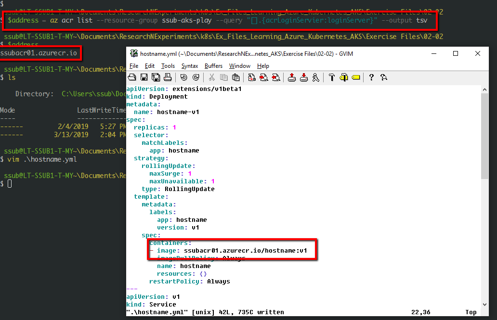
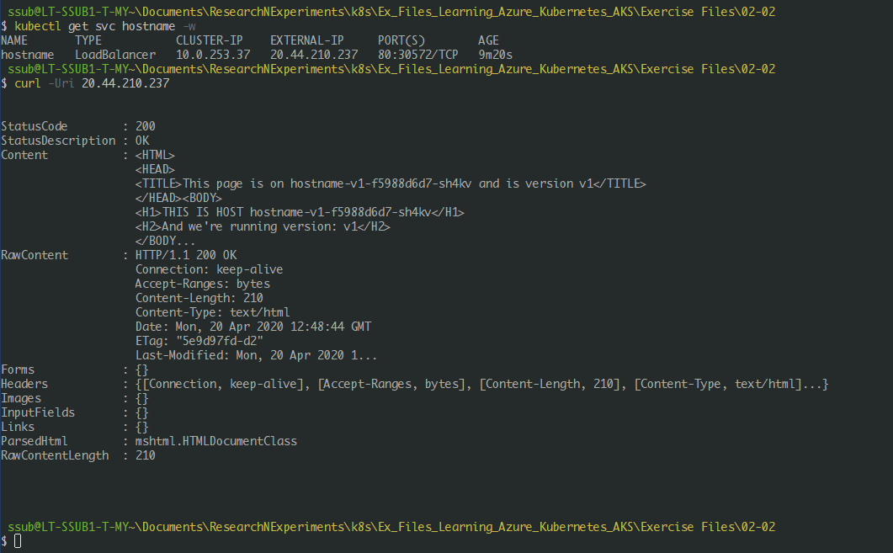
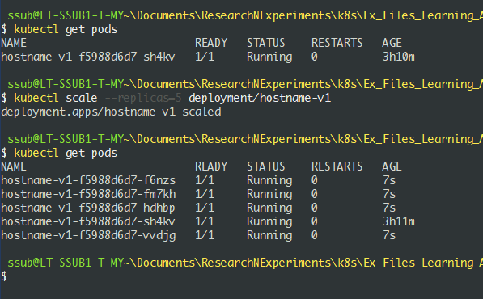

# Azure Kubernetes Services (AKS)

## Basics

Here is a simple architecture of AKS


## Azure Container Registry (ACR)

### Creating registry

```c#
//Create a resource group
az group create --name ssubaksrg --location 'East US'

//Create an ACR
az acr create --resource-group ssubaksrg --name ssubacr --sku Basic

//Login to ACR
az acr login --name ssubacr
```

### Pushing image to registry

First, check if you have local docker images. You can either pull an image from dockerhub or create one locally.


```c#
//check for local images
docker images

//example: create a new image
docker build <app_path> -t hostname:v1
```

Tag the image with the ACR address and push to ACR

```c#
//get the address
$address = az acr list --resource-group ssubaksrg --query '[].{acrLoginServer:loginServer}' --output tsv

//verify the result
$address

//tag the image, make sure the tag is applied
docker tag hostname:v1 $address/hostname:v1

//push and verify the image
docker push $address/hostname:v1
az acr repository list --name ssubacr

```

### Verify the image by running it locally

```c#
//remove the image
docker rmi $address/hostname:v1

//pull image from our ACR
docker pull $address/hostname:v1

//run a container from the image
docker run -rm --name hostname -p 8080:80 $address/hostname:v1

//verify that the container is running
curl -Uri http://localhost:8080

```

Cleanup the local resources
```c#
docker stop hostname
docker rmi $address/hostname:v1
```

## Kubernetes on Azure

### AKS Credentials

To allow an AKS cluster to interact with other azure resources such as the ACR, an azure AD service principal is used.

Here are the steps to achieve it.
```c#
//creats sp and gets the result
az ad sp create-for-rbac --skip-assignment

//copy the result into a file, e.g
New-Item ..\sp.txt

//edit the file by using vim, paste the result, save and exit
vim ../sp.txt

//get the contents of the file to confirm
Get-Content ..\sp.txt

// the content should look like below:
{
  "appId": "b5993773-6635-4243-8f62-dbd7d75d75c6",
  "displayName": "azure-cli-2020-04-19-12-55-58",
  "name": "http://azure-cli-2020-04-19-12-55-58",
  "password": "365578e4-e631-40a9-9c9d-98154dc5d76b",
  "tenant": "91700184-c314-4dc9-bb7e-a411df456a1e"
}

//get the resource id
az acr show --resource-group ssubaksrg --name ssubacr --query "id" --output tsv

//create a role assignment, using the app id from the sp.txt and the resource id from the command above
az role assignment create --assignee b5993773-6635-4243-8f62-dbd7d75d75c6 --scope /subscriptions/a58f4f07-6319-4d8a-b908-1e047d2fd178/resourceGroups/ssubaksrgy/providers/Microsoft.ContainerRegistry/registries/ssubacr --role Reader
```

For more information on intergrating with AD, please refer to
https://docs.microsoft.com/en-us/aks/aad-integration


### Creating an AKS cluster

```c#
az extension add --name aks-preview

//get the supported aks versions
az aks get-versions --location 'East US' --output table


az aks create --resource-group ssubaksrg --name ssubaks  --node-count 1 --max-pods 31 --kubernetes-version 1.16.7 --generate-ssh-keys   --enable-vmss --enable-cluster-autoscaler --min-count 1 --max-count 3 --service-principal b5993773-6635-4243-8f62-dbd7d75d75c6 --client-secret 365578e4-e631-40a9-9c9d-98154dc5d76b
```

```c#
//get kubectl

az aks install-cli

az aks get-credentials --resource-group ssubaksrg --name ssubaks --admin

//verify kubectl is working
kubectl get nodes

//verify versions
kubectl version
```

## Scaling AKS workers

### App deployment

Understand available size optins in VM

```c#
az vm list-sizes -l 'East US'
```

Deploying an app.
```c#
//get the acr url
 $address = az acr list --resource-group ssubaksrg --query "[].{acrLoginServier:loginServer}" --output tsv

//verify the result
$address
```

Edit the yaml file to include the address in the containers image.


> **WARNING**: the deployment version "apiVersion:extension/v1beta1" is deprecated use '**apiVersion:apps/v1**'

Deploying an app, continued...
```c#
kubectl apply -f hostname.yml

//get / watch the load balancer service externam IP
kubectl get svc hostname -w

//verify the site is up and running
curl -Uri <external_ip_>
```

Example: 

### Scaling nodes and pods

#### Manually scale the pods.
```c#
kubectl scale --replicas-5 deployment/hostname-v1

//verify
kubectl get pods

//reset back to origin deployment
kubectl apply -f hostname.yaml
```
Example:



#### Auto scale the pods.
```c#
kubectl autoscale deployment hostname-v1 --cpu-percent=50 --min=3 --max=10

//verify / vie wstatus
kubectl get hpa
kubectl get pods

//remove the hpa (disable autoscaling)
kubectl delete hpa hostname-v1
```
> **INFO**: hpa stands for Horizontal pods autoscaller


#### Cluster scale during creation
```c#
az aks scale --resource-group ssubaksrg --name ssubaks --node-count 3
```

### Cluster scale on the fly
The auto-scaling needs to be done at cluster create time, as it is not possible to enable autoscaling at the moment, or to change the min and max node counts on the fly (though we can manually change the node count in our cluster).

Cluster (nodes) will be scalled automatically when number of pods requirement exceeds the max pod limit


```c#
kubectl delete hpa hostname-v1

//Then we can scale our PODs (we set a max of 20 per node) to 25:
kubectl scale --replicas=25 deployment/hostname-v1

//observe
kubectl get pods -o wide -w
```

### Setting up nodes

```c#
//disable cluster auto scaling
az aks update --disable-cluster-autoscaler --resource-group ssubasksg --name ssubaks

az aks scale --resource-group ssubaksrg --name ssubaks --node-count 2

//get nodes & copy the name of the second node
kubectl get nodes

//add a label to the node
kubectl label node aks-nodepool1-29964270-vmss000001 anykey=anyvalue

```

Example using 2 yml. One without label the other with label
```c#
kubectl apply -f hostname.yml

//view the pods and which node they are in
kubectl get pods -o wide

kubectl apply -f hostname-anykey.yml

//view the pods and which node they are in
kubectl get pods -o wide

//scale pods
kubectl scale deploy hostname-v1 --replicas=5

//Notice that some nodes are deployed to the other node
kubectl get pods -0 wide
```


## AKS Storage and Networks

## Managing AKS deployments


