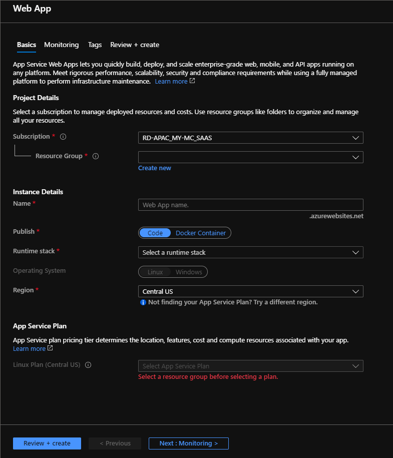

# Developing Azure Compute Solutions
https://www.linkedin.com/learning/developing-azure-compute-solutions

## Creating WebApps

### From Azure Portal

Go to marketplace and choose web apps under the web section.

Properties to remember:
* Instance Details: Name, Publish, Runtime Stack, OS, Regions
* Service Plan: SKU

### Creating VS Project

Create and open a folder (the project) folder.
Run `dotnet new mvc` to create a new project in the folder.

Press `f5` to run the project, Make sure you can see the default landing page on the browser.

Install the `c#` and `Azure App Service` Extensions.

Publish locally by running `dotnet publish -c Release -o ./publish`

right-click on the publish folder and choose **deploy to webapp**.

follow the instructions to login to azure.

### Azure Devops

Goto Azure portal and search/choose azure devops.

Create your organizations in a region.

Create a project with Git selected.

From the project, Create a new git repo for the project, with **README** and **visualStudio .gitignore**

### GitHub Repo

Login to your github account create a repo,
 with **README** , **visualStudio .gitignore** & **MIT License**

 coply the clone url

 go to your project folder in **bash**, create a repo by issuing the `git init` command then link the github repo by issueing the `git remote add <url>` command.

### Build Pipelines in Azure DevOps

Create a new pipeline in your demo project by using the classic editor.

Choose the relevant repo and branch (master)

Click Next and choose ASP.Net Core from the list.

Type in the title of the pipleline. then choose **Save**

Click on the **Publish Symbol Path** and remove it.

Click the **+** symbol in the **Agent job 1** then search for **npm**.
Add npm into the build steps and place it right under the Nuget Restore step.

in the npm step, select the root folder of the package.json in the working dir.

Go to **Triggers**

Check 'Enable continuous integration' then check 'Batch changes while a build is in progress'.

Save.

Go to the pipeline and click Run pipeline.

### Release Pipelines in Azure DevOps

Go to the overview page, hover over the Pipeline icon and select release.

Create new pipeline.

Select the **Azure App Service Deployment** template.

Name the stage, i.e "Development". Click on the **1 job, 1 task** link.
Select the subscription and app service name.
Change the release title accordingly.

Go to the release pipeline editor. 'Add and artifact'.
then choose **build** and choose the relevant build pipeline.

then click **Add**.

Click on the 'Lightnight bolt' icon on the artifact.
check the continuous deployment trigger and select a branch. close and save it.

Select the development stage, then select clone stage under the add arrow.

click the **1 job, 1 task** link
select the relevant app service.

Go to 'predeployment condition' of the QA stage.
make sure development is selected.

repeat the same for 'production' stage.

click on post deployment condition of the QA stage. select the approval and choose user(s) / group.

click on pre deployment condition of the production stage.
enable pre deployment approvals. and select users / group.

